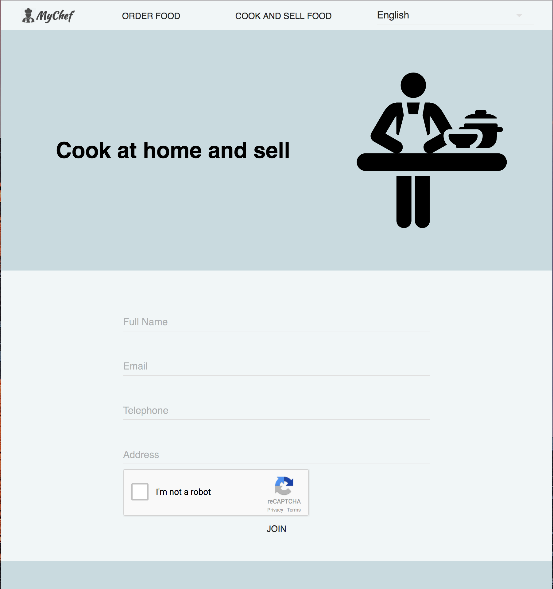
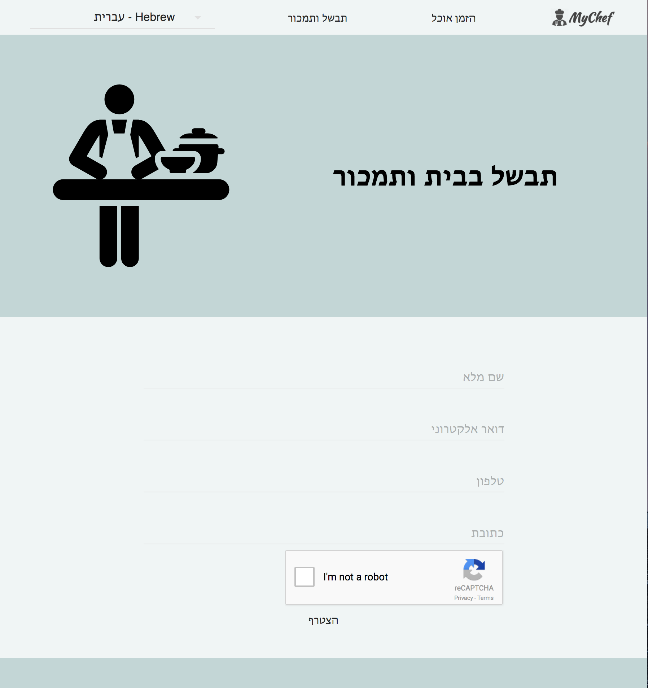

www.mychef.io

# screenshots






# Development instructions
## Installation
```bash
cd web-frontend
npm i
cd ../backend/
npm i
```

## Running (after code changes)
```bash
cd web-frontend
npm run build
cp -R ./build/ ../backend/public/
cd ../backend/
npm start
```

## Deployment to Google App Engine
```bash
gcloud app deploy
```